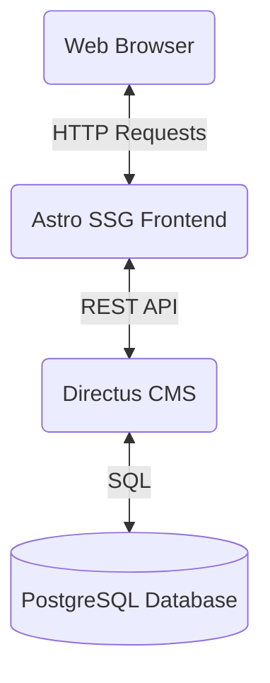

# Project Overview: Guayaquil Tourism Headless Website

This document provides a comprehensive overview of the architecture, data models, environment configuration, and setup instructions for the Dirección de Turismo de la Municipalidad de Guayaquil website.

## 1. System Architecture

The project follows a modern headless CMS architecture:

- **Frontend:** Astro (SSG for production with dynamic `output: 'static'`), styled with TailwindCSS using custom design tokens (Canvas, Ink, Amber, Terra, Estuary palettes).
- **Backend (CMS):** Directus (Node.js API + Vue.js Admin App).
- **Database:** PostgreSQL (Cloud SQL equivalent for production).
- **Hosting Strategy:** Docker containers for local development.

## 2. Database Schema (CMS Collections)

The CMS uses the relational Translations junction pattern to support 5 languages dynamically: `es`, `en`, `pt`, `fr`, `de`.
**Crucially, all slugs are localized**, meaning they reside in the translation collections rather than the parent items. Styling is controlled via semantic enum tokens in the database, avoiding hardcoded Tailwind classes.

### Global Settings
- **Global_Settings (Single Type):** Holds global stats (`vuelos_semanales`), brand logos, and shared CTA links.

### Shared Dynamic Collections
- **Categorias:** System tags linking Blog, Events, and Map landmarks. (Translations: `name`, `slug`).
- **Eventos:** Images, dates, category link, accent color enum. (Translations: `title`, `description`, `slug`).
- **Noticias (Blog):** Date, image, category link. (Translations: `title`, `excerpt`, `body`, `slug`).
- **Puntos_Interes (Landmarks):** X/Y map coordinates, category link. (Translations: `name`, `description`, `hours`, `price`).
- **Recorridos (Routes):** Route numbers, duration, image. (Translations: `title`, `description`, `stops`).
- **Aerolineas:** Airline name, logo image.
- **Destinos_Internacionales:** City name, country, airport code.

### Single Pages (Structured Layouts)
- **Page_Home**
- **Page_Descubre_GYE**
- **Page_Informacion_Util**
- **Page_Como_Llegar**
- **Page_Movilidad**
- **Page_Turismo_MICE**
- **Page_Buro_Convenciones**
- **Page_Razones_Guayaquil**
- **Page_Solicitud_Apoyo**

## 3. URL Structure & Routing
All routes are dynamic and language-prefixed:
`/[language_code]/[category_slug]/[item_slug]`

Examples:
- `es/que-hacer/gastronomia`
- `en/what-to-do/gastronomy`

The frontend includes a **Language Switcher** that resolves the translated slug of the current page.

## 4. Environment Variables Mapping

### Backend (Directus - `backend/.env`)
- `DB_CLIENT`: `pg`
- `DB_HOST`: `database`
- `DB_PORT`: `5432`
- `DB_DATABASE`: `directus`
- `DB_USER`: `directus`
- `DB_PASSWORD`: `directus_password`
- `KEY`, `SECRET`: Cryptographic keys for sessions.
- `ADMIN_EMAIL`, `ADMIN_PASSWORD`: Initial admin credentials.

### Frontend (Astro - `frontend/.env`)
- `PUBLIC_DIRECTUS_URL`: `http://localhost:8505` (or production URL)
- `DIRECTUS_TOKEN`: Static token for fetching draft content if needed.

## 5. Local Setup Instructions

1. **Start Backend Services:**
   Run `docker compose up -d` in the root folder.
2. **Initialize Schema:**
   Run `node backend/setup-schema.js` to create all collections and localized fields.
3. **Start Frontend:**
   Navigate to `/frontend`, run `npm install`, and start the dev server (`npm run dev`).
